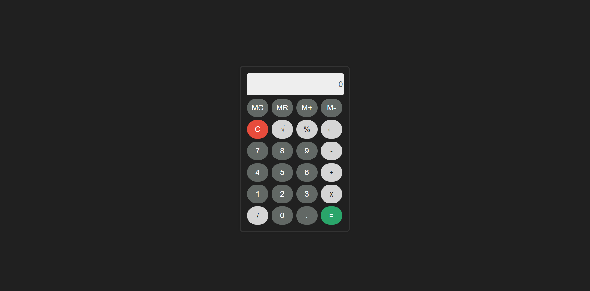
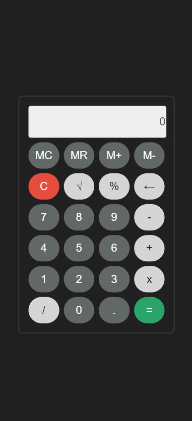

## Basic Calculator  

A simple web-based calculator built using HTML, CSS, and JavaScript. This project supports standard arithmetic operations and includes memory functions like MC, MR, M+, and M-.  

---

## 🛠 Features  

✔️ Basic arithmetic operations (+, -, ×, ÷)  
✔️ Memory functions (MC, MR, M+, M-)  
✔️ Square root & percentage calculations  
✔️ Responsive and user-friendly design  
✔️ Keyboard support for input  
✔️ Clear (C) and backspace (←) functionality  

---

## 📁 Project Structure  

```
Calculator/
│── css/                     # Stylesheets
│── img/                     # Images & icons
│── js/                      # JavaScript files
│── node_modules/            # Dependencies (if applicable)
│── .editorconfig            # Editor configuration
│── .gitattributes           # Git attributes file
│── 404.html                 # Custom error page
│── favicon.ico              # Favicon for the project
│── icon.png                 # PNG version of the icon
│── icon.svg                 # SVG version of the icon
│── index.html               # Main HTML file
│── LICENSE.txt              # License file
│── package-lock.json        # Package lock file
│── package.json             # Package configuration file
│── robots.txt               # Robots file for SEO
│── site.webmanifest         # Web manifest for PWA support
│── webpack.common.js        # Webpack common configuration
│── webpack.config.dev.js    # Webpack development configuration
│── webpack.config.prod.js   # Webpack production configuration
│── Basic Calculator.docx.pdf # Documentation (PDF)
│── README.md                # Project documentation (this file)
```

---

## 🚀 Installation & Setup  

### 1️⃣ Clone the repository  
```bash
git clone https://github.com/yourusername/calculator.git
cd calculator
```

### 2️⃣ Install dependencies (if using Node.js)  
```bash
npm install
```

### 3️⃣ Run the project  
Simply open `index.html` in your browser.  

If using Webpack for development:  
```bash
npm run dev
```
or to run the program use:
```bash
npm run start
```

For production build:  
```bash
npm run build
```

---

## 💡 How to Use  

1️⃣ Enter numbers and operators using the buttons or keyboard.  
2️⃣ Click `=` or press `Enter` to calculate the result.  
3️⃣ Use `MC`, `MR`, `M+`, `M-` for memory operations:  
   - **MC (Memory Clear)**: Clears stored memory  
   - **MR (Memory Recall)**: Recalls stored memory  
   - **M+ (Memory Add)**: Adds the current value to memory  
   - **M- (Memory Subtract)**: Subtracts the current value from memory  
4️⃣ Click `C` to clear the display or `←` to delete the last digit.  

---

## 📸 Screenshots  

### 🖥️ Desktop View


### 📱 Mobile View 

---

## 🖥️ Site Deployment
https://assassinmaeve.github.io/Calculator/

## 📜 License  

This project is licensed under the MIT License. See `LICENSE.txt` for details.  

---

## 🛠 Technologies Used  

- HTML5  
- CSS3  
- JavaScript (Vanilla JS)  
- Webpack (for build optimization)  

---

## 🤝 Contributing  

Feel free to contribute! Fork the repository, make your changes, and submit a pull request.  
